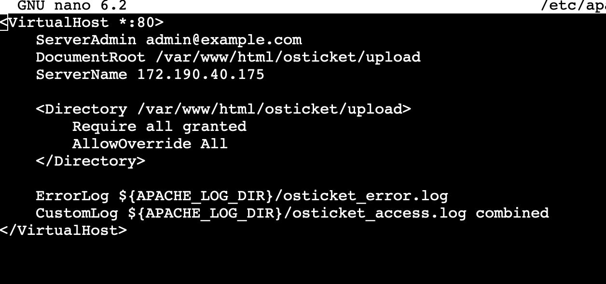
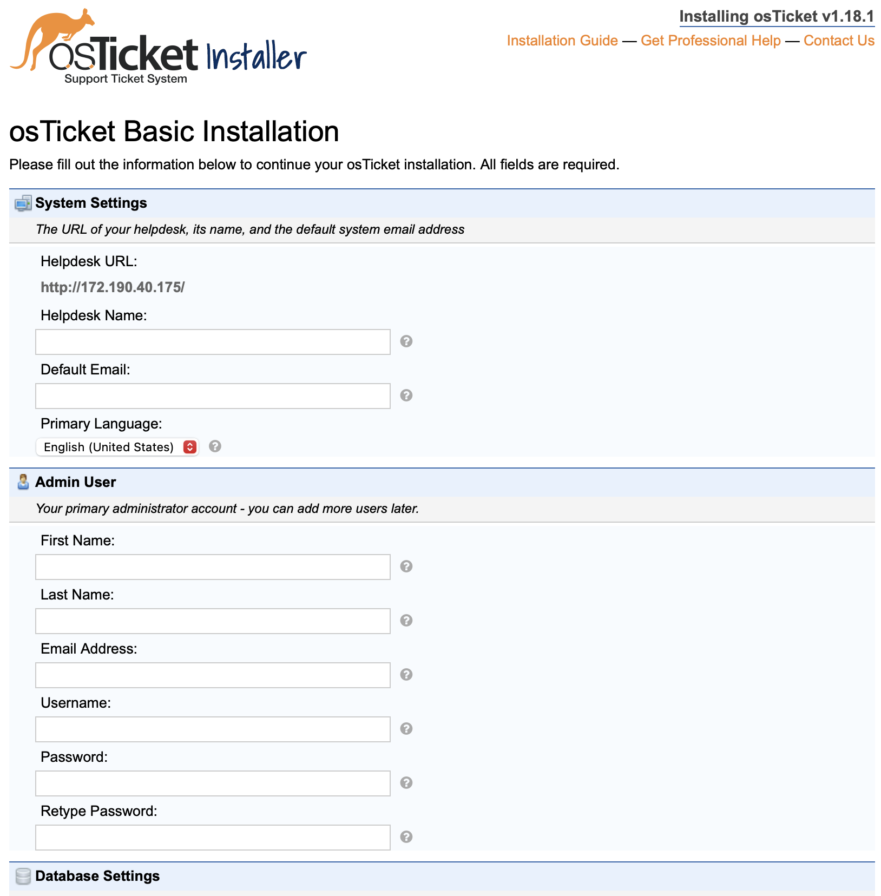
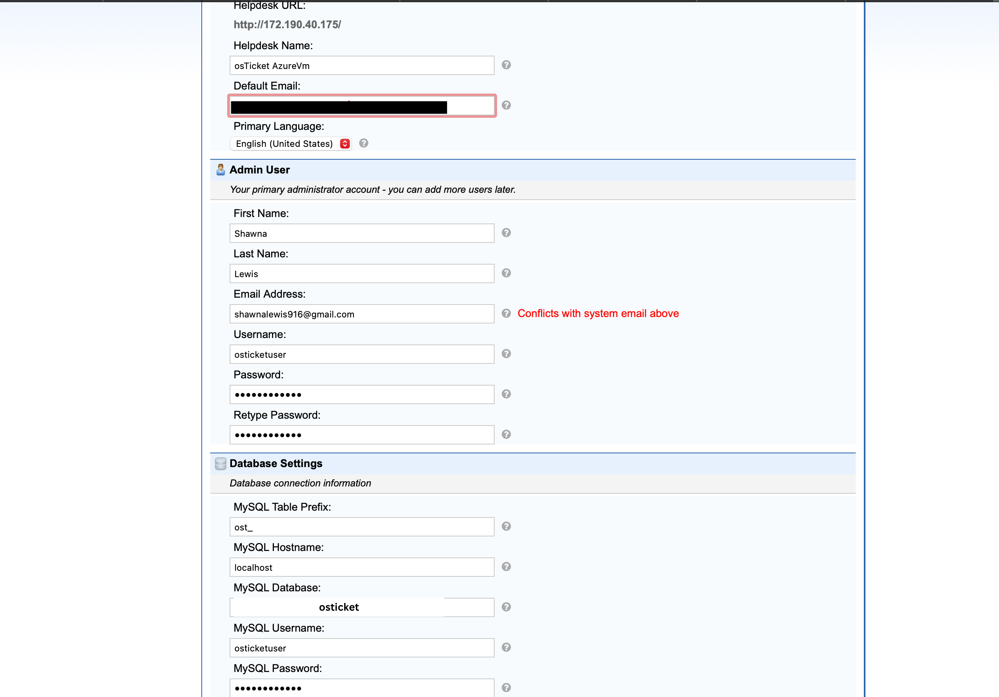

# osTicket-Installation
This guide is for individuals using a macOS or Unix-based host who want to set up a Helpdesk ticketing system using osTicket on a Microsoft Azure Virtual Machine running Ubuntu.

## Technologies Used

Operating System: Ubuntu Linux

Web Server: Apache2

Database: MySQL (MariaDB)

Scripting Languages: PHP 8.1, Bash (Linux commands)

Ticketing System: osTicket

Cloud Provider: Microsoft Azure

Version Control: Git & GitHub

## Installation Steps
### 1. Create a new Azure Virtual Machine  

 #### Select your __Subscription__ then create a new __Resource Group__ for your VM. Create a __Virtual Machine Name__. Choose a __Region__  and select your Ubuntu __Image__.
    

          
***     

#### Once your VM is created, it should be in  a __Running__ state. Click __Connect__ then __Connect__ again.

    

#### To access your Ubuntu VM select __SSH using Azure CLI__
  

#### Now that your VM is open, you need to update and upgrade the system. Run this command:
`sudo apt update && sudo apt upgrade -y`

****

### 2. Install Required Software  
   `sudo apt install -y apache2 mysql-server php libapache2-mod-php php-cli php-mbstring php-xml php-common php-mysql php-imap php-gd php-intl unzip php-apcu php-curl`

   ### Start and Enable the Services
   `sudo systemctl start apache2
sudo systemctl enable apache2
sudo systemctl start mysql
sudo systemctl enable mysql`

### Configure MariaDB (MySQL Database)
#### Secure MariaDB by running:
`sudo mysql_secure_installation`

#### Next you will need to: 
- [x] Set a root password (it will prompt you).
- [x] Remove anonymous users.
- [x] Disallow remote root login.
- [x] Remove test database.
- [x] Reload privileges.

### Create a database and user for osTicket:
#### Log into MariaDB:
`sudo mysql -u root -p`

### Run the following SQL commands to create a database and user for osTicket:
`CREATE DATABASE osticket;
CREATE USER 'osticketuser'@'localhost' IDENTIFIED BY 'yourpassword';
GRANT ALL PRIVILEGES ON osticket.* TO 'osticketuser'@'localhost';
FLUSH PRIVILEGES;
EXIT;`
#### Replace __'yourpassword'__ with a strong password.

****

### 3. Download and Install osTicket
#### Navigate to the web root directory:
`cd /var/www/html`
#### Download the latest osTicket release:
`curl -sSL https://github.com/osTicket/osTicket/releases/latest/download/osTicket-v1.17.zip -o osticket.zip`
#### Unzip the file:
`sudo unzip osticket.zip -d osticket`
#### Set permissions for the osTicket files:
`sudo chown -R www-data:www-data /var/www/html/osticket
sudo chmod -R 755 /var/www/html/osticket`

****

### 4. Configure Apache for osTicket
#### Create a new Apache configuration file for osTicket:
`sudo nano /etc/apache2/sites-available/osticket.conf`
#### Replace __ServerName__ with your actual public IP address:
   
#### Save and close (CTRL+X, then Y, then Enter)

### Enable the site and restart Apache:
`sudo a2ensite osticket.conf
sudo systemctl restart apache2`
****

### 5. Access osTicket Setup in a Browser
#### Open a browser and go to:
#### http://<Your-Public-IP/setup>
#### For example, my public IP address is: http://172.190.40.175/setup/ 
   

#### Fill out the form to finish the installation:
 

#### Complete the setup and create an admin account. Your default email and your Admin User email should be different. 
#### Database Settings:
- [x] MySQL Database: osticket
- [x] MySQL Username: osticketuser
- [x] MySQL Password: yourpassword

 

1. Finalizing Setup

🚀 Successfully deployed osTicket on Azure!
